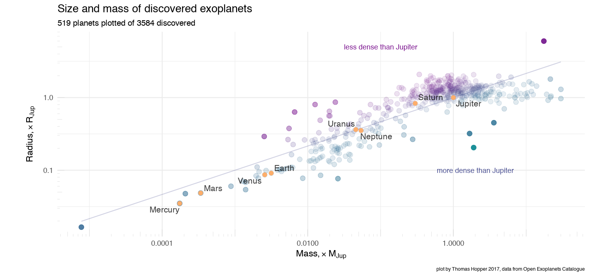

How big can a planet get?
===========================

With over 3500 exoplanets discovered in our galaxy, we can start to ask what planet size, mass and density looks like for all planets.

Plots all exoplanets and solar planets by planetary radius as a function of planetary mass, coloring by planet density.

All data is downloaded at runtime from the [csv version of the Open Exoplanets Catalog](https://raw.githubusercontent.com/OpenExoplanetCatalogue/) on Github.

Further demonstrates setting alpha transparency by point density on the plot, so that points on more dense areas of the plot are plotted with a higher transparency.

Graph
-----

